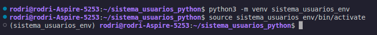
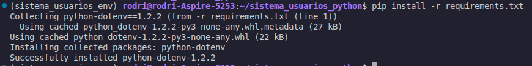
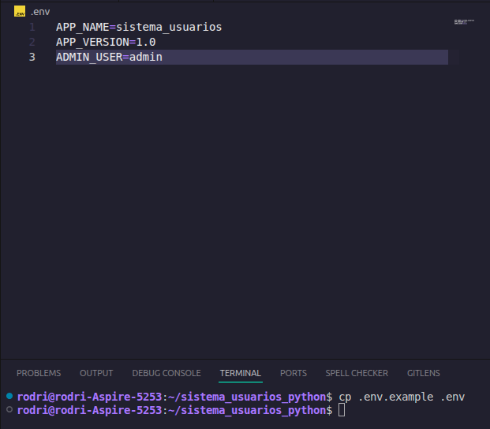
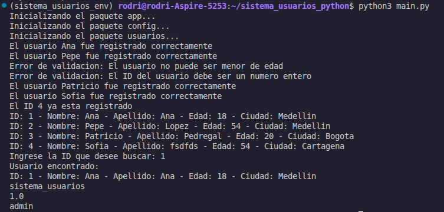

# Sistema de Usuarios Python
 
Sistema de registro y gestión de usuarios implementado en Python con arquitectura modular, validaciones de datos y configuración por variables de entorno.
 
---
 
## Requisitos previos
 
- Python 3.8 o superior
- pip
---
 
## Instalacion y configuracion
 
### 1. Creacion del entorno virtual
 
Desde la raiz del proyecto:
 
```bash
python -m venv sistema_usuarios_env
```
 
Activacion en Windows:
 
```bash
sistema_usuarios_env\Scripts\activate
```
 
Activacion en Linux / macOS:
 
```bash
source sistema_usuarios_env/bin/activate
```
 
**Captura - Creacion del entorno virtual:**
 

 
---
 
### 2. Instalacion de dependencias
 
Con el entorno virtual activo:
 
```bash
pip install -r requirements.txt
```
 
El archivo `requirements.txt` incluye:
 
```
python-dotenv
```
 
**Captura - Instalacion de dependencias:**
 

 
---
 
### 3. Configuracion de variables de entorno
 
Copiar el archivo de ejemplo:
 
```bash
cp .env.example .env
```
 
Editar `.env` con los valores reales:
 
```env
APP_NAME=sistema_usuarios
APP_VERSION=1.1.0
ADMIN_USER=admin
```
 
**Captura - Variables de entorno:**
 

 
---
 
### 4. Ejecucion del sistema
 
```bash
python main.py
```
 
**Captura - Ejecucion del sistema:**
 

 
---
 
## Estructura del proyecto
 
```
SISTEMA_USUARIOS_PYTHON/
├── app/
│   ├── __init__.py
│   ├── config/
│   │   ├── __init__.py
│   │   └── settings.py
│   └── usuarios/
│       ├── __init__.py
│       ├── gestor.py
│       └── validaciones.py
├── img/
├── sistema_usuarios_env/
├── .env
├── .env.example
├── .gitignore
├── main.py
├── README.md
└── requirements.txt
```
 
---
 
## Arquitectura modular
 
El proyecto esta organizado como un paquete Python con tres niveles de modulos. Cada nivel tiene una responsabilidad especifica y se comunica con los demas a traves de importaciones explicitas.
 
### `main.py` — Punto de entrada
 
Archivo raiz desde donde se ejecuta el programa. No contiene logica de negocio: su unico rol es llamar a las funciones publicas expuestas por el paquete `app`. Esto permite que el sistema sea ejecutado sin conocer los detalles internos de cada modulo.
 
---
 
### Paquete `app/`
 
Paquete principal del sistema. Su `__init__.py` inicializa y expone los submodulos `config` y `usuarios`.
 
| Archivo | Rol |
|---|---|
| `__init__.py` | Inicializa el paquete, importa y expone `config` y `usuarios`. Define `VERSION = "1.1.0"`. |
 
---
 
### Submodulo `app/config/`
 
Responsable exclusivamente de la configuracion del sistema. Lee las variables de entorno usando `python-dotenv` y las expone a traves de una funcion publica.
 
| Archivo | Rol |
|---|---|
| `settings.py` | Carga el archivo `.env` con `load_dotenv()`, lee `APP_NAME`, `APP_VERSION` y `ADMIN_USER` desde el entorno, y define `variables_entorno()` para mostrarlas. |
| `__init__.py` | Expone unicamente `variables_entorno` como interfaz publica del submodulo. |
 
---
 
### Submodulo `app/usuarios/`
 
Contiene toda la logica relacionada con los usuarios: la clase de datos, las operaciones sobre el diccionario de usuarios y las reglas de validacion. Esta separacion entre logica de negocio (`gestor.py`) y reglas de validacion (`validaciones.py`) permite modificar las validaciones sin tocar la logica principal.
 
| Archivo | Rol |
|---|---|
| `gestor.py` | Define la clase `Usuario` y las funciones `registro_usuarios()`, `listado_usuarios()` y `buscar_usuario()`. Almacena los usuarios en el diccionario `dicc_usuarios`. |
| `validaciones.py` | Define `validacion_datos()` y `validacion_buscar_id()`. Lanza `ValueError` si los datos no cumplen las reglas. No depende de ningun otro modulo del proyecto. |
| `__init__.py` | Expone las funciones publicas del submodulo para que `app/__init__.py` pueda importarlas directamente. |
 
---
 
## Reglas de validacion
 
El modulo `validaciones.py` aplica las siguientes reglas antes de registrar o buscar un usuario:
 
| Campo | Regla |
|---|---|
| `id` | Debe ser entero y mayor que cero. |
| `nombre` | No puede estar vacio ni contener solo espacios. |
| `apellido` | No puede estar vacio ni contener solo espacios. |
| `edad` | Debe ser entero, mayor que cero y mayor o igual a 18. |
| `ciudad` | No puede estar vacia ni contener solo espacios. |
| `id` (busqueda) | Debe ser entero y mayor que cero. |
 
Si alguna validacion falla, se lanza un `ValueError` que `gestor.py` captura con `try/except` e imprime sin interrumpir la ejecucion del programa.
 
---
 
## Flujo de ejecucion
 
```
main.py
  └── app.usuarios.registro_usuarios()   → valida → crea Usuario → guarda en dicc_usuarios
  └── app.usuarios.listado_usuarios()    → itera dicc_usuarios → imprime cada registro
  └── app.usuarios.buscar_usuario()      → lee input → valida → busca en dicc_usuarios
  └── app.settings.variables_entorno()  → imprime APP_NAME, APP_VERSION, ADMIN_USER
```